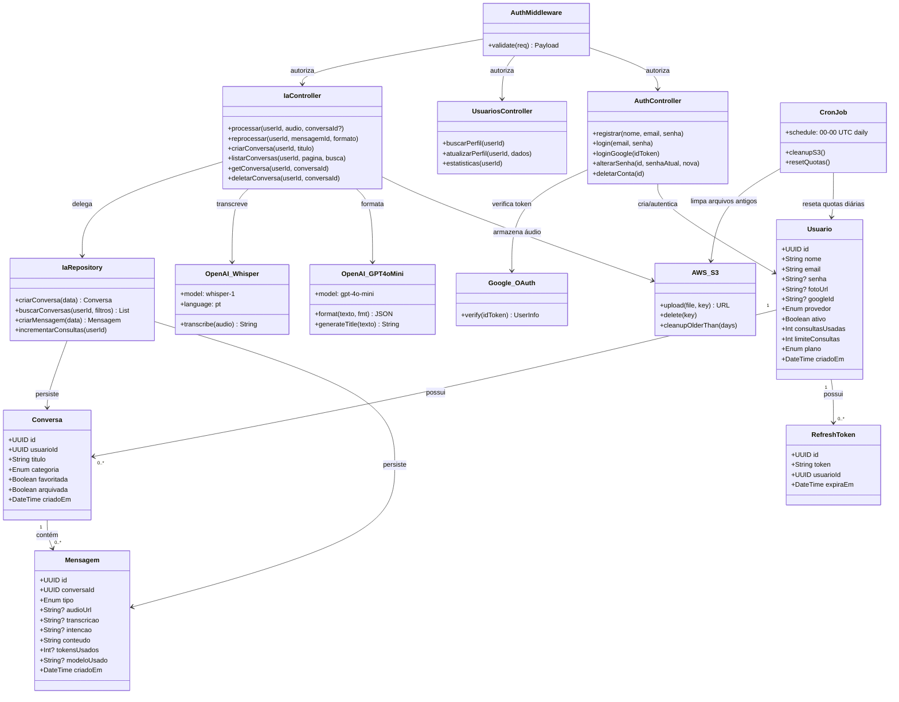

# Diagrama de Classes — FormataAI Backend

---

## Prompt para LLM de Imagem

> Use o texto abaixo como prompt completo para gerar a imagem do diagrama.

---

```
Gere um diagrama de classes UML técnico e profissional do backend de uma aplicação chamada FormataAI. 
O diagrama deve mostrar o fluxo completo de dados entre as tecnologias e camadas da aplicação. 
Use estilo dark/tech com fundo escuro (#1a1a2e), caixas com bordas arredondadas, 
setas de relação com labels, cores diferenciadas por camada, tipografia limpa estilo monospace.

=== ENTIDADES DO BANCO DE DADOS (cor: azul #4a9eff) ===

Classe: Usuario
- id: UUID (PK)
- nome: String
- email: String (unique)
- senha: String? (bcrypt, nullable)
- fotoUrl: String?
- googleId: String? (unique)
- provedor: Enum [EMAIL | GOOGLE]
- ativo: Boolean
- consultasUsadas: Int
- limiteConsultas: Int
- plano: Enum [GRATUITO | PREMIUM]
- criadoEm: DateTime
- atualizadoEm: DateTime

Classe: Conversa
- id: UUID (PK)
- usuarioId: UUID (FK → Usuario)
- titulo: String
- categoria: Enum [EMAIL | MENSAGEM | ORCAMENTO | DOCUMENTO | OUTRO]
- favoritada: Boolean
- arquivada: Boolean
- criadoEm: DateTime
- atualizadoEm: DateTime

Classe: Mensagem
- id: UUID (PK)
- conversaId: UUID (FK → Conversa)
- tipo: Enum [USUARIO | ASSISTENTE]
- audioUrl: String? (URL do S3)
- transcricao: String?
- intencao: String?
- conteudo: String
- tokensUsados: Int?
- modeloUsado: String?
- criadoEm: DateTime

Classe: RefreshToken
- id: UUID (PK)
- token: String (unique, indexed)
- usuarioId: UUID (FK → Usuario)
- expiraEm: DateTime
- criadoEm: DateTime

=== RELAÇÕES ENTRE ENTIDADES ===
- Usuario ||--o{ Conversa : "tem muitas"
- Usuario ||--o{ RefreshToken : "possui"
- Conversa ||--o{ Mensagem : "contém"
- Conversa }o--|| Usuario : "pertence a"
- Mensagem }o--|| Conversa : "pertence a"
- RefreshToken }o--|| Usuario : "pertence a (cascade delete)"

=== CAMADA DE SERVIÇOS EXTERNOS (cor: verde #2ecc71) ===

Classe: OpenAI_Whisper
- model: "whisper-1"
- language: "pt"
- maxFileSize: 25MB
+ transcribe(audioBuffer: Buffer): String

Classe: OpenAI_GPT4oMini
- model: "gpt-4o-mini"
+ format(transcricao: String, formato: String): { intencao, categoria, resposta }
+ generateTitle(texto: String): String

Classe: AWS_S3
- bucket: String
- region: String
+ upload(file: Buffer, key: String): String (URL pública)
+ delete(key: String): void
+ cleanupOlderThan(days: Int): void

Classe: Google_OAuth
- clientId: String
+ verify(idToken: String): { googleId, email, nome, fotoUrl }

=== CAMADA DE MIDDLEWARE (cor: amarelo #f39c12) ===

Classe: AuthMiddleware
+ validate(req): { id, email } (decodifica JWT)

Classe: UploadMiddleware
+ validateAudio(req): Buffer (multer, max 15MB, tipos: mp3/wav/webm/ogg/flac/m4a)

Classe: RateLimiter
- max: 100 req
- window: 15 min

=== CAMADA DE CONTROLLERS / REPOSITÓRIOS (cor: roxo #9b59b6) ===

Classe: AuthController
+ registrar(nome, email, senha): { token }
+ login(email, senha): { token }
+ loginGoogle(idToken): { token }
+ alterarSenha(id, senhaAtual, novaSenha): void
+ deletarConta(id): void

Classe: IaController
+ processar(userId, audioFile, conversaId?): { transcricao, resposta, audioUrl, categoria }
+ reprocessar(userId, mensagemId, formato): { resposta }
+ criarConversa(userId, titulo): Conversa
+ listarConversas(userId, pagina, busca): Conversa[]
+ getConversa(userId, conversaId): Conversa + Mensagem[]
+ atualizarConversa(userId, conversaId, dados): Conversa
+ deletarConversa(userId, conversaId): void

Classe: IaRepository
+ criarConversa(data): Conversa
+ buscarConversas(userId, filtros): Conversa[]
+ buscarConversa(id): Conversa | null
+ criarMensagem(data): Mensagem
+ atualizarTituloConversa(id, titulo): void
+ incrementarConsultas(userId): void

Classe: UsuariosController
+ buscarPerfil(userId): Usuario
+ atualizarPerfil(userId, dados): Usuario
+ estatisticas(userId): { consultasUsadas, limiteConsultas, plano }

=== FLUXO PRINCIPAL DE DADOS (setas com labels) ===

[Cliente Flutter]
  → POST /api/ia/processar (multipart/audio)
    → [AuthMiddleware] valida JWT
      → [UploadMiddleware] valida arquivo de áudio
        → [IaController.processar()]
          → [AWS_S3.upload()] armazena áudio → retorna audioUrl
          → [OpenAI_Whisper.transcribe()] transcreve áudio → retorna texto
          → [OpenAI_GPT4oMini.format()] formata texto → retorna JSON
          → [IaRepository.criarConversa()] cria/atualiza conversa no PostgreSQL
          → [IaRepository.criarMensagem()] salva mensagem USUARIO e ASSISTENTE
          → [IaRepository.incrementarConsultas()] atualiza quota do usuário
        ← retorna { transcricao, resposta, audioUrl, categoria, conversaId }
  ← resposta JSON

=== FLUXO DE AUTENTICAÇÃO ===

[Cliente]
  → POST /api/auth/login
    → [AuthController.login()]
      → consulta [PostgreSQL: Usuario]
      → [bcrypt.compare()] verifica senha
      → [JWT.sign()] gera token (7 dias)
    ← { token: "eyJ..." }

=== CRON JOB (diário 00:00 UTC) ===

[CronJob]
  → [AWS_S3.cleanupOlderThan(10 days)] remove áudios antigos
  → [PostgreSQL] reset consultasUsadas = 0 para todos usuários

=== STACK TECNOLÓGICO (exibir como legenda no canto) ===
Runtime:    Node.js 22 + TypeScript
Framework:  Express.js v5
ORM:        Prisma 7 + PostgreSQL 16
AI:         OpenAI Whisper-1 + GPT-4o-mini
Storage:    AWS S3
Auth:       JWT + Google OAuth 2.0
Infra:      Docker + Nginx + Let's Encrypt

O diagrama deve ter layout vertical com fluxo de cima para baixo:
Topo: Cliente → Middleware Stack
Meio: Controllers e Repositories
Direita: Serviços Externos (OpenAI, S3, Google)
Base: Banco de dados PostgreSQL com entidades
Cron Job flutuando no canto inferior esquerdo.
Inclua ícones tecnológicos reconhecíveis onde possível (Node.js, PostgreSQL, AWS, OpenAI).
Resolução mínima: 2400x1600px, alta densidade de informação, visual de documentação técnica profissional.
```

---

## Diagrama Mermaid (renderizável no GitHub / VS Code)



---

## Resumo Arquitetural para Contexto

| Camada | Tecnologia | Responsabilidade |
|---|---|---|
| Cliente | Flutter | UI, gravação de áudio, JWT |
| API Gateway | Express.js v5 + Nginx | Roteamento, SSL, rate limiting |
| Auth | JWT + Google OAuth 2.0 | Tokens, sessão, OAuth |
| IA Core | OpenAI Whisper + GPT-4o-mini | Transcrição + formatação |
| Storage | AWS S3 | Armazenamento de áudios |
| ORM | Prisma 7 | Queries tipadas, migrations |
| Banco | PostgreSQL 16 | Persistência de dados |
| Infra | Docker + docker-compose | Orquestração de containers |
| Cron | node-cron | Limpeza S3 + reset de quotas |
